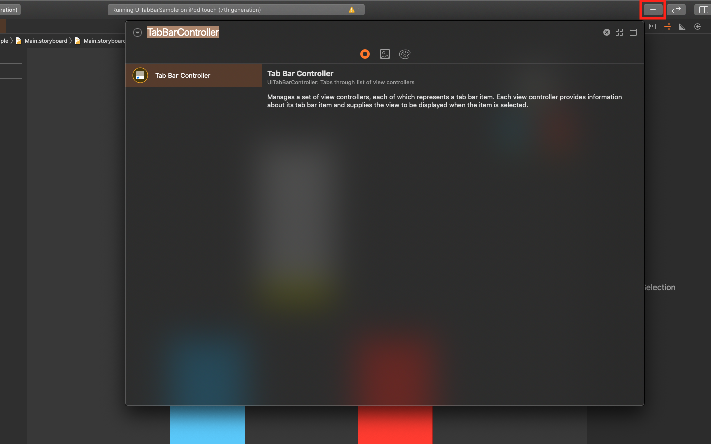
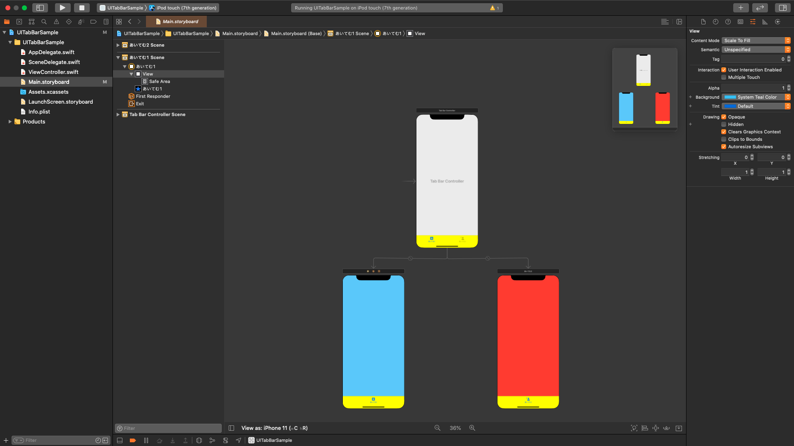

# UITabBarSample

## UITabBarとは

- AndroidでいうBottomNavigation。
- 子要素にViewControllerを持っていて、それらを切り替える。
- コードから作成する方法と、IBから作成する方法の2通りがある。(今回はIBから)

## 導入方法

1. +ボタンからウィンドウを表示して、storyboardにTabBarControllerを追加する。

2. 親のTabBarController、子のViewControllerが二つ表示されるので、それぞれのタブに対する設定を加える。

## 備考

### それぞれのアイコンの画像は、子のViewControllerから設定する。

- Androidだとmenu.xmlとかにまとめて記述するが、iOSだと子のViewControllerに依存するっぽい。
- 画像下部のテキストやカラー情報など、他のプロパティに関しても同じ。

### 最初に表示されるViewControllerは、(多分)自動的に一番左のやつになるっぽい。

- この辺を制御するならコードからTabBarを生成した方が良さそう。

